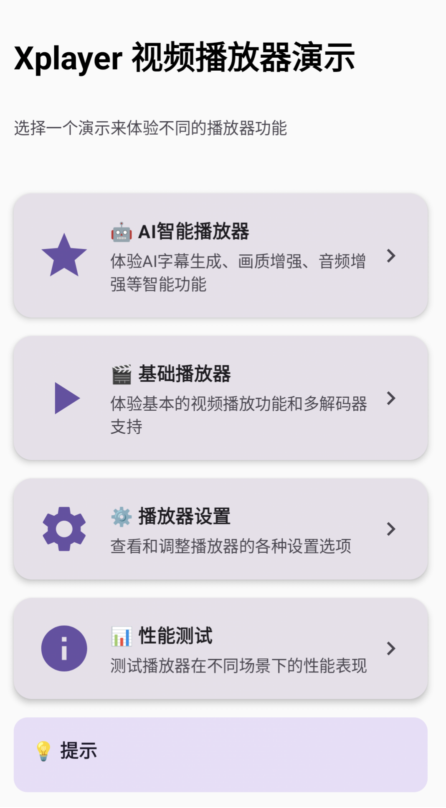
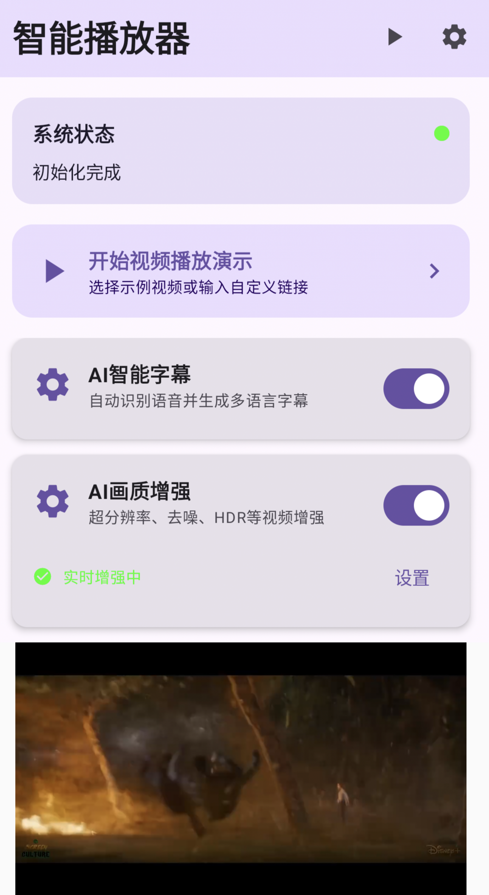

# 🎬 Xplayer - 智能视频播放器

一个基于Android平台的开源智能视频播放器，集成了AI字幕生成、画质增强、音频优化等先进功能。


、


## ✨ 特性亮点

### 🤖 AI智能功能
- **智能字幕生成**: 自动识别语音并生成多语言字幕
- **AI画质增强**: 超分辨率、去噪、HDR等实时视频增强
- **音频智能优化**: 3D音效、降噪、动态均衡器
- **实时处理**: 支持播放过程中的实时AI增强

### 🎯 播放器核心功能
- **多解码器支持**: 系统默认、IJKPlayer、ExoPlayer三种解码器
- **多种渲染模式**: TextureView、SurfaceView渲染支持
- **手势控制**: 支持亮度、音量、进度手势调节
- **悬浮窗播放**: 支持小窗口悬浮播放
- **多种缩放模式**: 裁剪、拉伸、原始比例等

### 🎨 现代化界面
- **Material Design 3**: 采用最新设计规范
- **Jetpack Compose**: 声明式UI开发
- **响应式设计**: 适配不同屏幕尺寸
- **深色模式**: 支持系统主题切换

## 📱 应用截图

<table>
  <tr>
    <td align="center">
      
      <br/>
      <b>演示主界面</b>
    </td>
    <td align="center">
      
      <br/>
      <b>AI智能播放器</b>
    </td>
  </tr>
</table>

## 🚀 快速开始

### 环境要求
- Android Studio Arctic Fox+
- JDK 17+
- Android SDK 34+
- Kotlin 1.9.0+

### 安装步骤

1. **克隆项目**
```bash
git clone https://github.com/your-username/Xplayer.git
cd Xplayer
```

2. **配置环境**
```bash
# 确保JAVA_HOME指向JDK 17
export JAVA_HOME=/path/to/jdk-17
```

3. **构建项目**
```bash
./gradlew assembleDebug
```

4. **安装APK**
```bash
adb install app/build/outputs/apk/debug/app-debug.apk
```

### 快速体验

1. 启动应用，进入演示主界面
2. 选择 **🤖 AI智能播放器**
3. 点击 **开始视频播放演示**
4. 选择示例视频或输入自定义URL
5. 体验AI增强功能

## 🏗️ 项目架构

### 模块结构
```
Xplayer/
├── app/                    # 主应用模块
│   ├── ai/                # AI功能模块
│   ├── demo/              # 演示功能
│   └── ui/                # 用户界面
├── xplayer/               # 核心播放器
├── widget/                # UI组件库
├── ijk/                   # IJKPlayer集成
├── exo/                   # ExoPlayer集成
└── cache/                 # 视频缓存
```

### 技术栈

| 技术 | 版本 | 用途 |
|------|------|------|
| Kotlin | 1.9.0 | 主要开发语言 |
| Jetpack Compose | 1.5.2 | 现代化UI框架 |
| TensorFlow Lite | 2.13.0 | AI模型推理 |
| ExoPlayer | 2.19.1 | 媒体播放 |
| IJKPlayer | Latest | 备用播放器 |
| Coroutines | 1.7.3 | 异步处理 |

## 🤖 AI功能详解

### 智能字幕生成
- **语音识别**: 基于TensorFlow Lite的实时语音转文字
- **多语言支持**: 支持中文、英文等多种语言
- **字幕导出**: 支持SRT、VTT格式导出
- **实时同步**: 与视频播放完美同步

### 画质增强
- **超分辨率**: AI算法提升视频分辨率
- **智能去噪**: 自动识别并减少视频噪点
- **HDR处理**: 改善动态范围和色彩表现
- **边缘增强**: 提升画面清晰度

### 音频优化
- **3D音效**: 空间音频处理
- **智能降噪**: 环境噪音消除
- **动态压缩**: 自动调节音量范围
- **均衡器**: AI驱动的智能均衡

## 📖 使用指南

### 基本播放
```kotlin
// 创建播放器实例
val videoPlayer = VideoPlayer(context)
videoPlayer.initController()

// 设置数据源
videoPlayer.setDataSource("https://example.com/video.mp4")

// 开始播放
videoPlayer.prepareAsync()
```

### AI功能集成
```kotlin
// 初始化智能播放器管理器
val smartPlayerManager = SmartPlayerManager.getInstance(context)

// 配置AI功能
val config = SmartPlayerManager.SmartPlayerConfig(
    autoGenerateSubtitles = true,
    enableVideoEnhance = true,
    enableAudioEnhance = true
)

// 初始化
smartPlayerManager.initialize(config)

// 绑定播放器
smartPlayerManager.bindPlayer(videoPlayer, playerId)
```

### 自定义UI
```kotlin
@Composable
fun CustomPlayerScreen() {
    SmartPlayerScreen(
        onVideoSelected = { videoUrl ->
            // 处理视频选择
        },
        onSettingsClick = {
            // 打开设置界面
        }
    )
}
```

## 🎨 自定义主题

支持Material Design 3主题自定义：

```kotlin
MaterialTheme(
    colorScheme = if (isSystemInDarkTheme()) darkColorScheme() else lightColorScheme()
) {
    SmartPlayerScreen()
}
```

## 🔧 配置选项

### AI功能配置
```kotlin
data class SmartPlayerConfig(
    val autoGenerateSubtitles: Boolean = true,     // 自动生成字幕
    val enableVideoEnhance: Boolean = false,       // 视频增强(性能考虑)
    val enableAudioEnhance: Boolean = true,        // 音频增强
    val enableRealtimeProcessing: Boolean = false  // 实时处理
)
```

### 播放器配置
```kotlin
// 解码器选择
videoPlayer.setMediaPlayerFactory { context ->
    when (decoderType) {
        0 -> null                                    // 系统默认
        1 -> IjkPlayerFactory.create().createPlayer(context)  // IJK
        2 -> ExoPlayerFactory.create().createPlayer(context)  // EXO
        else -> null
    }
}

// 渲染器选择
videoPlayer.setRenderViewFactory { context ->
    when (renderType) {
        0 -> TextureRenderView(context)              // TextureView
        1 -> SurfaceRenderView(context)              // SurfaceView
        else -> null
    }
}
```

## 🤝 贡献指南

我们欢迎所有形式的贡献！

### 开发流程
1. Fork 项目
2. 创建特性分支 (`git checkout -b feature/AmazingFeature`)
3. 提交更改 (`git commit -m 'Add some AmazingFeature'`)
4. 推送到分支 (`git push origin feature/AmazingFeature`)
5. 创建 Pull Request

### 代码规范
- 遵循 Kotlin 官方编码规范
- 使用 ktlint 进行代码格式化
- 编写单元测试覆盖新功能
- 更新相关文档

### 问题反馈
- 使用 [GitHub Issues](https://github.com/your-username/Xplayer/issues) 报告问题
- 提供详细的重现步骤
- 包含设备信息和日志

## 📚 文档资源

- [API文档](docs/api.md)
- [开发者指南](docs/developer-guide.md)
- [AI功能详解](docs/ai-features.md)
- [性能优化](docs/performance.md)
- [常见问题](docs/faq.md)

## 🏆 版本历史

### v2.0.0 (2024-01-XX)
- 🎉 全新AI智能功能
- 🎨 Material Design 3界面重构
- 🚀 Jetpack Compose UI框架
- 🤖 智能字幕生成
- 🎬 画质增强功能
- 🎵 音频智能优化

### v1.0.0 (Previous)
- 基础视频播放功能
- 多解码器支持
- 手势控制
- 悬浮窗播放

## 📄 许可证

本项目采用 MIT 许可证 - 查看 [LICENSE](LICENSE) 文件了解详情。

## 🙏 致谢

- [TensorFlow Lite](https://www.tensorflow.org/lite) - AI模型推理
- [ExoPlayer](https://exoplayer.dev/) - 媒体播放框架
- [IJKPlayer](https://github.com/bilibili/ijkplayer) - 视频播放器
- [Jetpack Compose](https://developer.android.com/jetpack/compose) - UI工具包
- [Material Design](https://material.io/) - 设计规范

## 📞 联系我们

- 项目主页: [GitHub Repository](https://github.com/wangkangmao/Xplayer)
- 问题反馈: [Issues](https://github.com/wangkangmao/Xplayer/issues)
- 邮箱: 1240413544@qq.com

---

<p align="center">
  <strong>🌟 如果这个项目对你有帮助，请给我们一个Star！ 🌟</strong>
</p>

<p align="center">
  Made with ❤️ by the Xplayer Team
</p>
